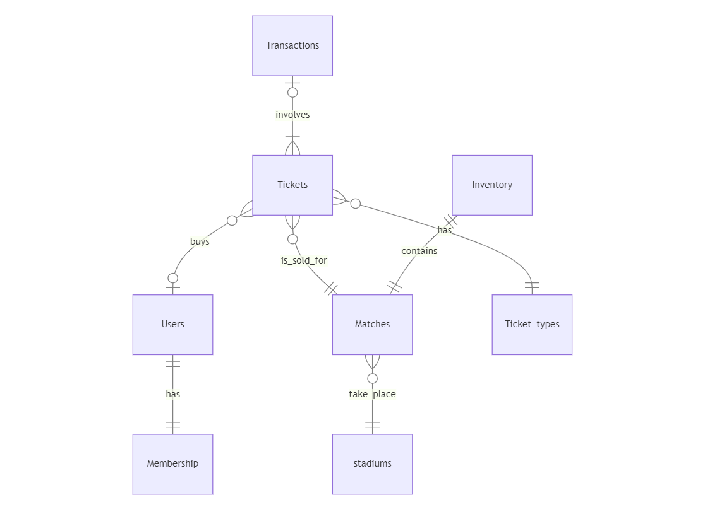

# Design Document

By Qing Deng

Video overview: <URL [https://youtu.be/ftfZGXUhn9I]>

## Scope

This database is designed to efficiently manage the ticketing system of a football club, facilitating ticket purchases and membership management.it provides seamless access to tickets for different matches. it also tracks users' membership status and tickets inventory.

the basic idea for ticket sales is as follows:

when tickets for a match become available, users who have tickets of types 'season' or 'subscription' have priority to reserve initially. Following this stage, users with active memberships have next priority access. After that, if tickets remain available, former members can purchase tickets. After that stage, individuals with an account can make purchases.

As such, included in the database's scope is:

* matches, including basic infomations about a specific match
* tickets, representing tickets for each match and their current status
* ticket types, representing all the types of tickets available
* users, including basic infomations about a user
* membership, including membership current status, and joining/quiting data
* transactions, including transactions for ticket purchases
* stadium, where matches take place
* inventory, tracking remaining tickets

*outside* the scope are user authentication and session management, like login/logout details, and how long they remain login

## Functional Requirements

this database supports:

* users are able to register and provide their basic infomation, and to purchase tickets
* managing membership: update status, including activation, expiration, and track membership history, joining and qiutting dates
* adding, editing and deleing match details
* managing tickets inventory

Users can't make financial transactions directly. Users may purchase tickets but payment processing is handled externally.
tickets with discount are not handled.

## Representation

Entities are captured in Mysql tables with the following schema.

### Entities
The database includes the following entities:

#### Users

The `users` table includes:

* `id`, which specifies the unique ID for the club members as an `INT`. This column thus has the `PRIMARY KEY` constraint applied, also with AUTO INCREMENT.
* `name`, which specifies a user's name using `VARCHAR(50)`, it's appropriate for name fields with a reasonable size.
* `email`, which specifies email address from users and is used for login, the most common data type is `VARCHAR(100)`.
* `password`, which stores hashed passwords chosen by the users, using SHA-256, which produces a 256-bit hash, so the type is `BINARY(64)`.
* `address`, which specifies users' addresses, using `VARCHAR(255)`to store the entire address as a single string.

All columns are required and hence have the `NOT NULL` constraint applied where a `PRIMARY KEY` constraint is not. because one person is only allowed to have one account, `email` should be `UNIQUE`.

#### Membership

the `membership` table includes:

* `id`, which specifies the unique ID for membership as an `INT`. This column thus has the `PRIMARY KEY` constraint applied, also with AUTO INCREMENT.
* `user_id`, which is the id of the user as an `INT`. This column thus has the `FOREIGN KEY` constraint applied
* `status`, which specifies the current status of the membership from a user. it can only be `ENUM('active', 'expired')`
* `start_date`, which specifies when the user bacame a member as an `DATE`
* `end_date`, which specifies when the user cancels their mebership as an `DATE`

All columns except `end_date` are required and hence have the `NOT NULL` constraint applied where a `PRIMARY KEY` or `FOREIGN KEY` constraint is not.

#### Matches

the `matches` table includes:

* `id`, which specifies the unique ID for each match as an `INT`. This column thus has the `PRIMARY KEY` constraint applied, also with AUTO INCREMENT
* `stadium_id`, which is the id of the stadium where the match takes place as an `INT`. This column thus has the `FOREIGN KEY` constraint applied
* `date`, which specifies when the match takes place as an `DATETIME`, this data tpye can store the date precisely to second
* `type`, which specifies if it'a home or away match as `ENUM('home', 'away')`. a match can only has one type applied
* `opponent`, which specifies the name of another team as an `VARCHAR(100)`, which is a common type for a team name

All columns are required and hence have the `NOT NULL` constraint applied where a `PRIMARY KEY` or `FOREIGN KEY` constraint is not.

#### Stadiums

the table `stadiums`includes:

* `id`, which specifies the unique ID for each stadium as an `INT`. This column thus has the `PRIMARY KEY` constraint applied, also with AUTO INCREMENT
* `name`, which specifies the name of the stadium as an `VARCHAR(50)`, because name is usually a string
* `address`, which specifies where the stadium locates, using `VARCHAR(255)`to store the entire address as a single string
* `capacity`, which specifies how many people it can hold as an `INT`, because it is a digital number

All columns are required and hence have the `NOT NULL` constraint applied where a `PRIMARY KEY` or `FOREIGN KEY` constraint is not.

#### Tickets

the `tickets` table includes:

* `id`, which specifies the unique ID for each ticket as an `INT`. This column thus has the `PRIMARY KEY` constraint applied, also with AUTO INCREMENT
* `user_id`, which is the id of the ticket holder as an `INT`. This column thus has the `FOREIGN KEY` constraint applied
* `match_id`, which is the id of the match where the ticket is sold for as an `INT`. This column thus has the `FOREIGN KEY` constraint applied
* `ticket_type_id`, which is the type of the ticket as an `INT`. This column thus has the `FOREIGN KEY` constraint applied
* `transaction_id`, which indicates through which transaction is the ticket purchased as an `INT`. This column thus has the `FOREIGN KEY` constraint applied
* `status`, which specifies the current status of the ticket, if it's sold, reserved or available. The data type is `ENUM('sold', 'reserved', 'available')`
* `location`, specifies the location of the ticket as an `VARCHAR(100)`, because it is the description of the seat or section, it consists of three parts. For example: A4-R10-S4 indicates block A4, row 10, seat 4.
* `sold_date`, which specifies when the ticket is sold or reserved as an `DATETIME`, so we can get a precise data to second
* `sold_price`, which is the actual price when the ticket is sold as an `DECIMAL(5, 2)`. using decimal is because sometimes there is a percent discount.

All columns except `sold_date`and `sold_price`, are required and hence have the `NOT NULL` constraint applied where a `PRIMARY KEY` or `FOREIGN KEY` constraint is not.

#### Ticket Types

the `ticket_types` table includes:

* `id`, which specifies the unique ID for each ticket type as an `INT`. This column thus has the `PRIMARY KEY` constraint applied, also with AUTO INCREMENT
* `type`, which specifies what kind of ticket it is as in `ENUM('day', 'season', 'subscription', 'discount')`. `season` refers to a user purchasing all the ticets for the whole season, while `subscription` refers to a user being able to purchase tickets for every season until they cancel it.

All columns are required and hence have the `NOT NULL` constraint applied where a `PRIMARY KEY` or `FOREIGN KEY` constraint is not.

#### Inventory

the `inventory`table includes:

* `id`, which specifies the unique ID for inventory as an `INT`. This column thus has the `PRIMARY KEY` constraint applied, also with AUTO INCREMENT`
* `match_id`, which is the id of the match where the ticket is sold for as an `INT`. This column thus has the `FOREIGN KEY` constraint applied
* `total_tickets`, which specifies how many tickets are to be sold for a match as an `INT`
* `remaining_tickets`, which specifies how many tickets are still available for a match as an `INT`

All columns are required and hence have the `NOT NULL` constraint applied where a `PRIMARY KEY` or `FOREIGN KEY` constraint is not.

#### Transactions

the table `transactions`includes:

* `id`, which specifies the unique ID for each transaction as an `INT`. This column thus has the `PRIMARY KEY` constraint applied, also with AUTO INCREMENT`
* `transaction_date`, which specifies when the transaction takes place as an `DATETIME`, because it is usually precise to the second
* `transaction_amount`, which specifies how much money is transferred as an `DECIMAL(5, 2)`, because a ticket price can contain cents
* `payment_method`, which specifies how the paymant is made as in `ENUM('debit', 'visa', 'master', 'paypal')`, because the club only accepts certain payments

All columns are required and hence have the `NOT NULL` constraint applied where a `PRIMARY KEY` or `FOREIGN KEY` constraint is not.

### Relationships

The below entity relationship diagram describes the relationships among the entities in the database.

As detailed by the diagram:

* A user can only have one membership, which can be either expired or active. Similarly, each membership belongs to only one user.
* A ticket is purchased by only one user or not sold yet, but a user can buy more than one tickets or none at all.
* A transaction involves the sale of at least one ticket. Each ticket is either sold through a single transaction or remains available for purchase, meaning no transaction takes place.
* Each ticket belongs to only one ticket type. Each ticket type may have at least one ticket or none at all.
* A ticket is sold for a specific match, and each match may offer no tickets or more than one ticket.
* A match has one inventory, and each inventory is designated for one match.
* Each match is held in one stadium, and a stadium can host none or multiple matches.

## Optimizations

in this database some common queries would be:

* user-related: retrieving user details by user's name, listing all users who are current members, or getting user's purchase history.
therefore indexes are created on the `name` column in `users` table, `user_id` coloum in `matches` and `tickets` tables.

* match-related: listing all upcoming matches, retrieving match details, counting sold/reserved tickets for a certain match.
therefore indexes are created on the `date` in `matches` table and on the `match_id` column in `inventory` table.

* ticket-related: checking the availability of a specific ticket for a match.
therefor indexes are created on the `match_id` column in `tickets` table.

* transaction-related: listing transactions within a data range, retrieving transactions made by a specific user.
therefore indexes are created on the `transaction_date` column in `transactions` table, `transaction_id` column in `tickets` table.

## Limitations

the current schema doesn't track changes in membership status over time. For example, if a user's membership status changes from active to expired and then back to active again, the schema doesn't capture that history. by achiving that, a `membership_history` table should be added.

Similarly, when a ticket changes its ownership, it is not shown in the table.
